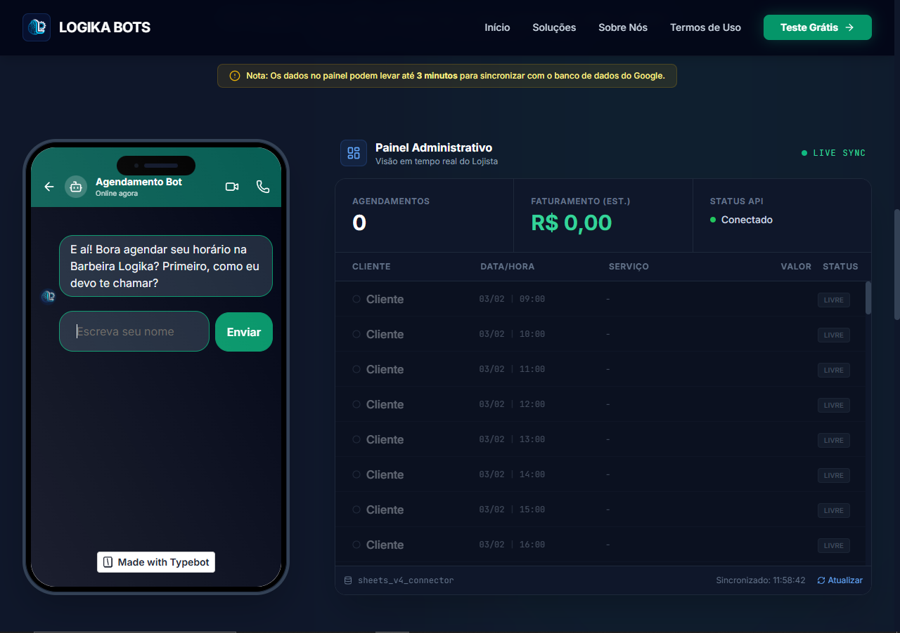
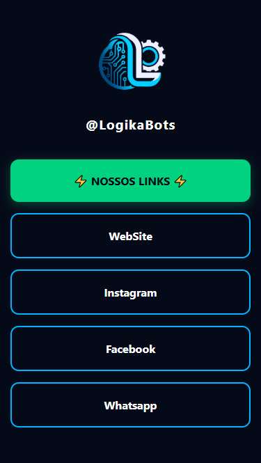

# 🚀 Logikabots - Landing Page & Conversational UI

Este repositório contém o ecossistema web desenvolvido para a **Logikabots**, empresa especializada em automação e chatbots inteligentes. O projeto foca em uma experiência de usuário imersiva, utilizando simulações reais de interação.

---

## 💻 Sobre o Projeto

O objetivo foi criar uma vitrine digital que não apenas descrevesse o serviço, mas demonstrasse a tecnologia na prática. O destaque do site é um **simulador de smartphone** que executa um fluxo real de chatbot.

### 🌟 Funcionalidades Principais
* **Simulador de Bot Interativo:** Interface responsiva que simula um celular, permitindo ao usuário testar a experiência do produto antes da compra.
* **Integração com TypeBot:** Fluxos conversacionais dinâmicos integrados diretamente na interface.
* **Arquitetura Serverless (Google Sheets):** Utilização do Google Sheets como banco de dados para captura de leads e logs, garantindo agilidade e baixo custo de manutenção.
* **Linktree Customizado:** Página de links exclusiva para redes sociais, mantendo a identidade visual da marca e centralizando os pontos de conversão.

---

## 🛠️ Tecnologias e Ferramentas

O projeto foi construído com foco em performance e design moderno:

* **Linguagens:** HTML5, CSS3, JavaScript (ES6+).
* **Estilização:** [Tailwind CSS](https://tailwindcss.com/) (Utilitários para design responsivo e ágil).
* **Engine de Chat:** [TypeBot](https://typebot.io/).
* **Backend/Banco:** Google Sheets API (Integração via Webhooks/Scripts).
* **Hospedagem:** https://logikabots.netlify.app/.

---

## 📸 Demonstração

| Landing Page Principal | Simulador de Bot | Linktree Instagram |
| :--- | :--- | :--- |
|  |  |  |

> **Dica:** Para deixar seu portfólio incrível, suba prints reais do site na pasta `/img` do seu repositório e substitua os links acima!

---

## 🏗️ Estrutura do Repositório

```text
├── /site-principal    # Landing page e simulador de bot
├── /linktree          # Página de links para redes sociais
├── /assets            # Imagens, ícones e fontes
└── README.md          # Documentação do projeto
